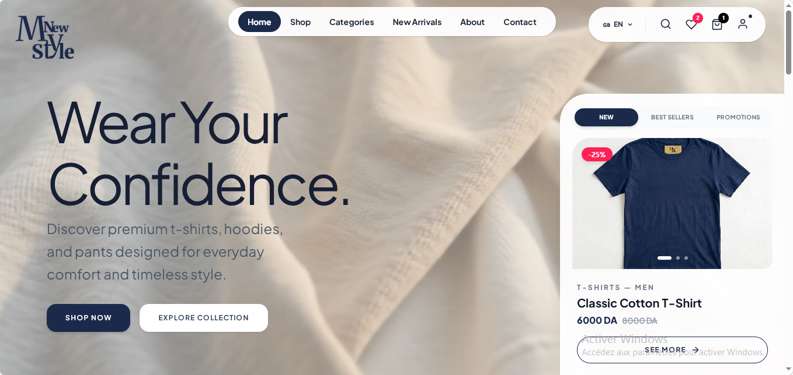

<p align="center">
  
</p>

<h1 align="center"></h1>

<p align="center">
  <strong>Wear Your Confidence.</strong><br/>
  Boutique de vêtements en ligne complète — vitrine, panier, commandes, avis clients et espace d'administration.
</p>

<p align="center">
  
  
  
  
  
  
</p>

---

## Sommaire

- [À propos](#à-propos)
- [Fonctionnalités](#fonctionnalités)
- [Stack technique](#stack-technique)
- [Structure du projet](#structure-du-projet)
- [Installation](#installation)
  - [Backend](#backend)
  - [Frontend](#frontend)
- [Variables d'environnement](#variables-denvironnement)
- [Accès administrateur](#accès-administrateur)
- [Déploiement](#déploiement)
- [Design System](#design-system)
- [Feuille de route](#feuille-de-route)

---

## À propos

**MyNewStyle** est une boutique de vêtements en ligne (t-shirts, hoodies, sweats, pantalons) construite de A à Z : catalogue filtrable, panier et commandes réelles avec gestion des stocks, comptes utilisateurs avec vérification par email, avis clients notés, et un espace d'administration complet pour gérer produits, commandes et statistiques de vente — le tout en trois langues (français, anglais, arabe avec support RTL).

## Fonctionnalités

### Côté client
- 🛍️ Catalogue avec filtres avancés (genre, catégorie, taille, prix, recherche en direct)
- 🆕 Sections dynamiques Nouveautés / Best-Sellers / Promotions (calculées depuis les vraies données)
- 🔐 Authentification avec vérification de compte par code envoyé par email
- 🛒 Panier persistant, gestion des quantités, vérification du stock en temps réel
- 📦 Commande sans paiement en ligne (règlement à la livraison), email de confirmation brandé
- ❤️ Liste de favoris
- ⭐ Système d'avis (un avis par compte, modifiable, supprimable)
- 🌍 Site multilingue FR / EN / AR avec bascule RTL automatique
- ⏳ Écran de chargement animé (utile pour les cold starts de Render)

### Côté administration (`/admin`)
- 📊 Tableau de bord avec statistiques : chiffre d'affaires cliquable, graphique mensuel, historique par année, alertes sur les mois à fort taux d'annulation/retour
- 👕 Gestion complète des produits : création, modification, upload photo (Cloudinary), stock par taille et par couleur, activation/désactivation, bascule Best-Seller / Promotion
- 📮 Gestion des commandes : recherche par référence/client/article, changement de statut (en attente → confirmée → expédiée → livrée / annulée / retournée)
- 💬 Modération des avis clients
- 📖 Guide d'utilisation intégré, avec les vrais composants de l'interface

## Stack technique

**Frontend**
- React (Vite)
- React Router DOM
- Tailwind CSS
- Framer Motion (animations)
- react-i18next (internationalisation)
- lucide-react (icônes)

**Backend**
- Node.js / Express
- MongoDB / Mongoose
- JWT (authentification)
- bcryptjs (hachage des mots de passe)
- Cloudinary (hébergement des images produits)
- Nodemailer (emails transactionnels)

**Déploiement**
- Frontend → Vercel
- Backend → Render
- Base de données → MongoDB Atlas

## Structure du projet

```
mynewstyle/
├── backend/
│   ├── config/          # Connexion MongoDB, Cloudinary, Nodemailer
│   ├── controllers/      # Logique métier (produits, commandes, auth, avis...)
│   ├── middleware/       # Auth JWT, vérification du rôle admin
│   ├── models/           # Schémas Mongoose (User, Product, Cart, Order, Review)
│   ├── routes/            # Définition des endpoints REST
│   ├── utils/             # Templates d'emails HTML
│   ├── seedAdmin.js       # Script de création du compte admin
│   └── server.js
│
└── frontend/
    ├── public/
    │   └── Readme.jpg
    └── src/
        ├── assets/         # Logos, vidéos, images du thème
        ├── components/     # Composants réutilisables (Navbar, ProductCard...)
        │   └── admin/       # Composants spécifiques à l'espace admin
        ├── context/         # AuthContext, CartContext, FavoritesContext
        ├── pages/            # Pages routées (Login, Cart, Profile...)
        │   └── admin/         # Pages de l'espace administrateur
        ├── i18n.js           # Traductions FR / EN / AR
        └── App.jsx
```

## Installation

### Backend

```bash
cd backend
npm install
```

Crée un fichier `.env` (voir [Variables d'environnement](#variables-denvironnement)), puis lance :

```bash
npm run dev
```

Le serveur démarre par défaut sur `http://localhost:5000`.

### Frontend

```bash
cd frontend
npm install
```

Crée un fichier `.env` avec :

```
VITE_API_URL=http://localhost:5000
```

Puis lance :

```bash
npm run dev
```

## Variables d'environnement

### Backend (`backend/.env`)

```env
# Base de données
MONGO_URI=mongodb+srv://...

# Authentification
JWT_SECRET=une_longue_chaine_secrete_aleatoire

# Cloudinary (photos produits)
CLOUDINARY_CLOUD_NAME=...
CLOUDINARY_API_KEY=...
CLOUDINARY_API_SECRET=...

# Emails transactionnels
EMAIL_HOST=smtp.gmail.com
EMAIL_PORT=587
EMAIL_USER=...
EMAIL_PASS=...
EMAIL_FROM=MyNewStyle <ton-adresse@exemple.com>
EMAIL_LOGO_URL=https://res.cloudinary.com/.../logo.png

PORT=5000
```

### Frontend (`frontend/.env`)

```env
VITE_API_URL=http://localhost:5000
```

## Accès administrateur

Un compte admin doit être créé manuellement une seule fois via le script fourni :

```bash
cd backend
node seedAdmin.js
```

Identifiants créés par défaut :

| Email | Mot de passe |
|---|---|
| `admin@admin.com` | `admin` |

⚠️ Pense à changer ce mot de passe une fois en production.

Une fois connecté avec ce compte, l'espace admin est accessible via l'icône profil dans la barre de navigation, ou directement sur `/admin`.

## Déploiement

### Backend → Render
Déploie le dossier `backend/` comme un Web Service Node. Renseigne toutes les variables d'environnement listées ci-dessus dans le dashboard Render.

### Frontend → Vercel
Déploie le dossier `frontend/`. Ajoute `VITE_API_URL` (pointant vers ton URL Render) dans les variables d'environnement Vercel.

Un fichier `vercel.json` est requis à la racine du frontend pour que les routes React Router fonctionnent après un rafraîchissement de page :

```json
{
  "rewrites": [
    { "source": "/(.*)", "destination": "/index.html" }
  ]
}
```

### À propos du cold start Render
Le plan gratuit de Render met le serveur en veille après une période d'inactivité, ce qui rend la première requête plus lente (30 à 60 secondes). Le site affiche un écran de chargement animé (logo qui se révèle progressivement) pendant que le serveur se réveille, plutôt qu'un écran blanc.

## Design System

> GitHub ne permet pas d'appliquer une police personnalisée dans ce fichier (le CSS y est filtré pour des raisons de sécurité) — cette section sert donc de référence écrite pour quiconque travaille sur le projet, pas d'aperçu visuel.

| Élément | Valeur |
|---|---|
| Police principale | `Plus Jakarta Sans` (repli : `Tajawal` pour l'arabe) |
| Couleur principale | `#1b2a4a` (bleu marine) |
| Couleur de fond | `#f5f2eb` (beige) |
| Coins arrondis | `rounded-2xl` / `rounded-3xl` (composants), `rounded-tl-[3rem]` (cartes signature) |
| Bibliothèque d'icônes | [lucide-react](https://lucide.dev) uniquement |

## Feuille de route

- [ ] Page produit dédiée (actuellement, la recherche renvoie vers la boutique filtrée)
- [ ] Pagination sur les listes admin (produits / commandes / avis)
- [ ] Filtre de stock faible dédié dans l'espace produits admin
- [ ] Export CSV des statistiques de vente

---

<p align="center">
  <sub>Construit avec React, Node.js et beaucoup de café ☕</sub>
</p>